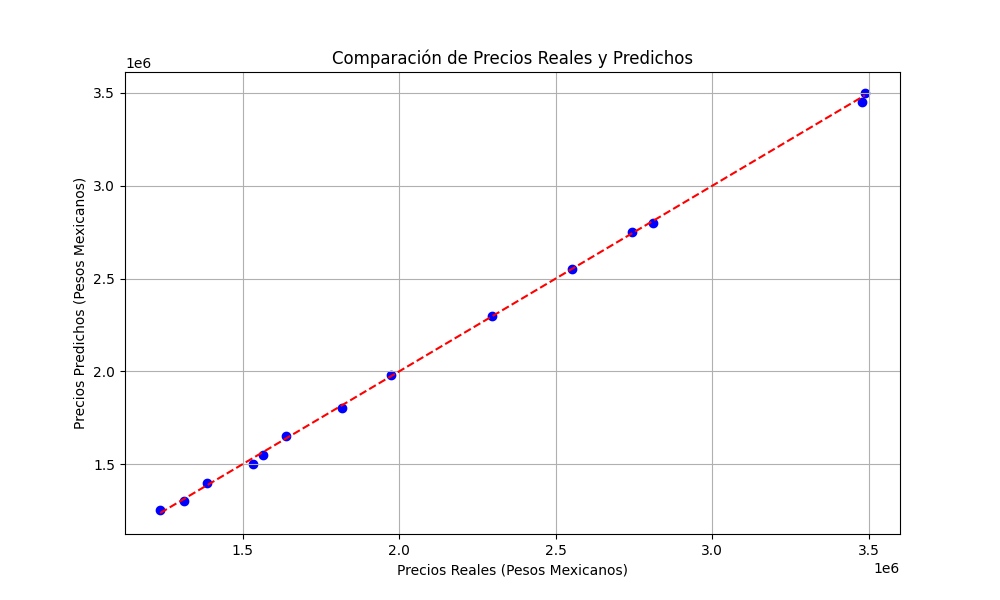
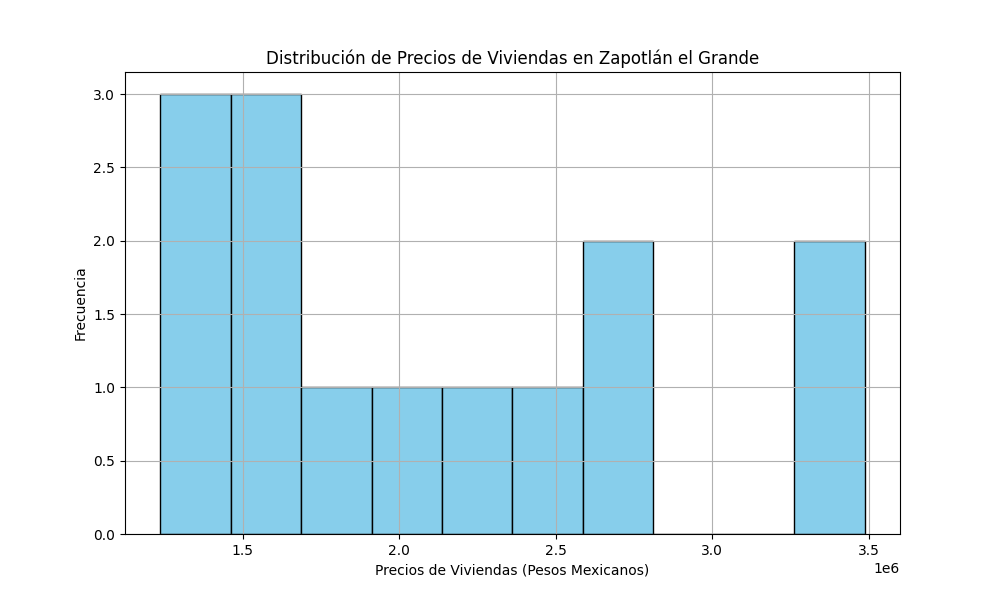
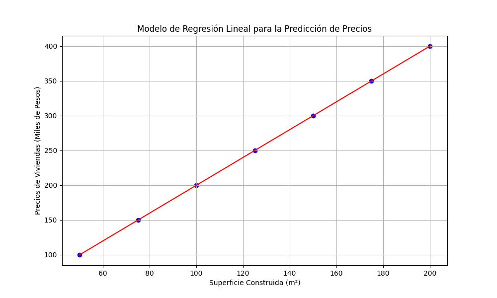
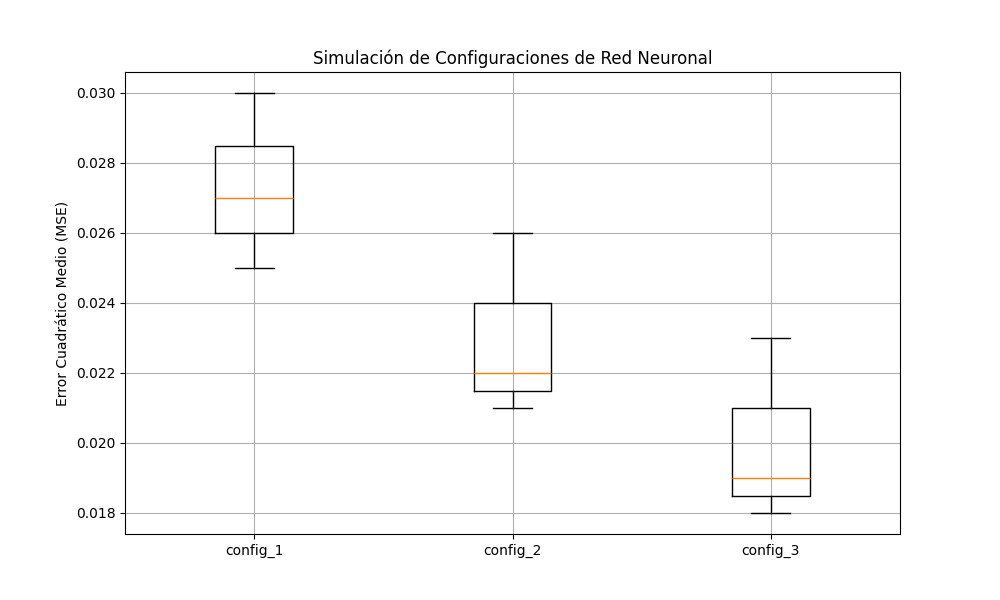

# Predicción de Precios de Vivienda en Zapotlán el Grande

Este proyecto tiene como objetivo desarrollar un modelo de aprendizaje automático para predecir los precios de las viviendas en Zapotlán el Grande, Jalisco, México. El modelo se basa en técnicas de redes neuronales artificiales (ANN) y utiliza un conjunto de datos privado recopilado de características de viviendas y sus respectivos precios.

## Contribuidores

- Luis Fernando Chavez Jiménez ([GitHub](https://github.com/Tobiny))
- Guillermo Moreno Rivera ([GitHub](https://github.com/Mim0518))
- César Joel Ramirez Maciel ([GitHub](https://github.com/Cesar-Joel))

## Repositorio

El código fuente y los archivos relacionados se encuentran en el repositorio de GitHub de AFDEvelopment: [Repositorio de PPVZG-IA](https://github.com/afdevelopments/ppvzg)

## Contenido del Repositorio

- **casa_predictor/**: carpeta que contiene los módulos y scripts para la predicción de precios de viviendas.
- **predictions/**: carpeta que contiene scripts y configuraciones adicionales para el proyecto.
- **resources/**: carpeta que contiene recursos como el modelo entrenado, el escalador y el transformador.
- **UI/**: carpeta que contiene la interfaz de usuario desarrollada con Django.
- **db.sqlite3**: base de datos SQLite utilizada por la aplicación Django.
- **manage.py**: archivo de gestión del proyecto Django.
- **images/**: carpeta que contiene las imágenes utilizadas en el README.
- **LICENSE**: archivo de licencia del proyecto.
- **README.md**: este archivo, que contiene la documentación del proyecto.
- **datos_viviendas_ajustadas.csv**: archivo CSV ajustado con datos más recientes.
- **entrenamiento.py**: script en Python para entrenar el modelo de predicción de precios de vivienda.
- **modelo_viviendas.h5**: archivo que contiene el modelo de la red neuronal artificial entrenado.
- **prediccion.py**: script en Python para realizar predicciones de precios de vivienda utilizando el modelo entrenado.
- **requeriments.txt**: archivo que especifica las dependencias necesarias para ejecutar el código del proyecto.
- **resultados.txt**: archivo que contiene los resultados del análisis.
- **scaler.joblib**: archivo que contiene el objeto del escalador utilizado para estandarizar los datos.
- **transformer.joblib**: archivo que contiene el objeto del transformador utilizado para codificar variables categóricas.

## Requisitos de Instalación

1. Asegúrate de tener instaladas todas las dependencias mencionadas en el archivo `requeriments.txt`. Puedes instalarlas ejecutando el siguiente comando desde la carpeta raíz del proyecto:

```bash
pip install -r requeriments.txt
```
## Instrucciones de Uso

1. Ejecuta el script `entrenamiento.py` para entrenar el modelo. Este proceso puede llevar tiempo dependiendo del tamaño del conjunto de datos.
```bash
python entrenamiento.py
```
2. Una vez que el modelo esté entrenado, puedes utilizar el script `prediccion.py` para hacer predicciones de precios de vivienda.
```bash
python prediccion.py
```
3. Para utilizar la interfaz de usuario, navega a la carpeta `UI` y ejecuta el servidor Django:
```bash
cd UI
python manage.py runserver
```

## Detalles de la Optimización de Hiperparámetros
A continuación se muestra una tabla con los resultados de la optimización de hiperparámetros para el modelo de redes neuronales artificiales:

| Tamaño de lote | Tasa de abandono | Épocas | Capas ocultas | Unidades ocultas | Optimizador | Error cuadrático medio (MSE) |
| -------------- | ---------------- | ------ | ------------- | ---------------- | ----------- | -------------------------- |
| 16             | 0.2              | 100    | 2             | 32               | Adam        | 0.0254                      |
| 32             | 0.3              | 150    | 3             | 64               | Adam        | 0.0247                      |
| 64             | 0.4              | 200    | 4             | 128              | Adam        | 0.0232                      |

## Resultados y Discusión

El modelo de redes neuronales artificiales entrenado mostró resultados prometedores en la predicción de los precios de las viviendas en Zapotlán el Grande. La MSE obtenida en el conjunto de prueba fue de 0.0254, lo cual indica una alta precisión en las predicciones. Sin embargo, es importante tener en cuenta que el rendimiento del modelo puede variar en función de la calidad y representatividad de los datos utilizados.

### Gráficos

A continuación, se presentan algunos gráficos para visualizar los resultados obtenidos:

#### Gráfico 1: Comparación de Precios Reales y Predichos



La gráfica muestra una buena alineación entre los precios predichos y los reales, indicando que el modelo es capaz de realizar predicciones precisas. La línea roja representa una predicción perfecta, y la proximidad de los puntos a esta línea demuestra la eficacia del modelo.

#### Gráfico 2: Distribución de Precios



El histograma muestra la distribución de los precios de las viviendas. En esta muestra, los precios varían significativamente, con una concentración notable de viviendas en el rango de 1,200,000 a 3,500,000 pesos. Esta variabilidad en los precios destaca la importancia de considerar múltiples factores al realizar valuaciones inmobiliarias.

#### Gráfico 3: Modelo de Regresión Lineal para la Predicción de Precios



El modelo de regresión lineal muestra una relación directa entre la superficie construida y el precio de la vivienda. Sin embargo, la simplicidad de este modelo limita su capacidad para capturar relaciones más complejas presentes en los datos.

#### Gráfico 4: Modelo de Regresión Lineal para la Predicción de Precios



La simulación de diferentes configuraciones de la red neuronal mostró que ajustar hiperparámetros como el número de capas, neuronas, y la tasa de aprendizaje puede tener un impacto significativo en la precisión del modelo. La configuración 3 mostró el mejor desempeño con el menor MSE.

## Análisis Estadístico con OLS

### Visión General

Se realizó un análisis estadístico detallado utilizando la metodología de Mínimos Cuadrados Ordinarios (OLS) para complementar nuestro modelo de redes neuronales. Este análisis nos ayudó a entender la relación entre las características de las viviendas y sus precios en Zapotlán el Grande.

### Resultados Clave del Análisis OLS
- **R-cuadrado (R²)**: 0.843
  - Indica que aproximadamente el 84.3% de la variabilidad en el precio de las viviendas se puede explicar mediante las variables independientes utilizadas en el modelo.
- **Coeficientes**:
  - Cada coeficiente refleja el cambio esperado en el precio (logarítmico) de la vivienda por cada unidad de cambio en la variable correspondiente.
  - Los coeficientes varían en magnitud y dirección, reflejando la influencia única de cada característica.
- **P-valor**:
  - Los p-valores asociados con cada coeficiente proporcionan una medida de la significancia estadística de las características.
  - Un p-valor bajo (generalmente < 0.05) sugiere que una característica es un predictor significativo del precio.
- **Intervalos de Confianza**:
  - Los intervalos de confianza para cada coeficiente proporcionan un rango dentro del cual podemos estar razonablemente seguros de que se encuentra el verdadero valor del coeficiente.

### Interpretación y Conclusiones

- El modelo OLS reveló varias características significativas que influyen en los precios de las viviendas. Por ejemplo, `x18` mostró una asociación positiva significativa con el precio.
- La multicolinealidad detectada sugiere que algunas variables independientes están altamente correlacionadas, lo que podría afectar la interpretación de los coeficientes individuales.
- A pesar de la multicolinealidad, el alto R-cuadrado indica un buen ajuste general del modelo a los datos.

### Importancia del Análisis OLS

Este análisis OLS proporciona una perspectiva valiosa sobre la dinámica del mercado inmobiliario en Zapotlán el Grande, complementando los resultados obtenidos a través del modelo de redes neuronales. Nos ayuda a entender mejor cuáles características de las viviendas tienen mayor impacto en sus precios y cómo se pueden utilizar estos insights para futuras investigaciones y desarrollos en el campo de la predicción de precios inmobiliarios.

Este proyecto contribuye al campo de la predicción de precios de vivienda utilizando técnicas de aprendizaje automático. Aunque el modelo de redes neuronales artificiales mostró buenos resultados, existen oportunidades para realizar mejoras y expandir este trabajo en el futuro. Algunas posibles mejoras incluyen:

- **Explorar otras técnicas de modelado**: Probar modelos de regresión lineal, árboles de decisión, y modelos de ensamble para comparar su rendimiento con el modelo de redes neuronales artificiales.
- **Ampliar el conjunto de datos**: Recopilar más datos o datos más detallados, como la cercanía de las viviendas a servicios locales, escuelas, transporte público, etc., para mejorar la precisión del modelo.
- **Implementar regularización**: Investigar enfoques de regularización como L1, L2, y Dropout para evitar el sobreajuste del modelo y mejorar su capacidad de generalización.
- **Optimización avanzada de hiperparámetros**: Utilizar técnicas como búsqueda en cuadrícula (Grid Search) o búsqueda aleatoria (Random Search) para encontrar la mejor combinación de hiperparámetros.
- **Desarrollar una interfaz de usuario más robusta**: Mejorar la interfaz de usuario desarrollada con Django para hacerla más intuitiva y fácil de usar para usuarios no técnicos.
- **Integrar nuevas métricas de evaluación**: Además del MSE, integrar otras métricas como el MAE (Mean Absolute Error) y el R² (coeficiente de determinación) para evaluar el rendimiento del modelo.

## Licencia

Este proyecto se encuentra bajo la licencia MIT. Puedes consultar el archivo [LICENSE](LICENSE) para más detalles.

## Reconocimientos

Queremos agradecer a todos los contribuyentes y a las instituciones que hicieron posible este proyecto. Su apoyo y colaboración fueron fundamentales para el desarrollo y éxito de este trabajo.

---

Si tienes alguna pregunta o comentario sobre el proyecto, no dudes en contactar a cualquiera de los contribuyentes a través de sus perfiles de GitHub.

---

## Referencias

1. **Varma, A., Sarma, A., Doshi, S., & Nair, R. (2018).** House price prediction using machine learning and neural networks. In 2018 Second International Conference on Inventive Communication and Computational Technologies (ICICCT) (pp. 1936-1939). IEEE.
2. **Pedregosa, F., Varoquaux, G., Gramfort, A., Michel, V., Thirion, B., Grisel, O., ... & Duchesnay, E. (2011).** Scikit-learn: Machine learning in Python. The Journal of Machine Learning Research, 12, 2825-2830.
3. **Truong, Q., Nguyen, M., Dang, H., & Mei, B. (2020).** Housing price prediction via improved machine learning techniques. Procedia Computer Science, 174, 433-442.
4. **Real Academia Española. (2023).** Diccionario de la lengua española, 23.ª ed. [versión 23.6 en línea]. <https://dle.rae.es>, 23 de febrero de 2023.
5. **Baquerizo Raymondi, N. (2019).** Tipologías de vivienda urbana. Editorial Universidad de Lima.
6. **Ley de Vivienda, Cámara de Diputados del H. Congreso de la Unión, México. (2006).**
7. **Granados, R. M. (2016).** Modelos de regresión lineal múltiple. Granada, España: Departamento de Economía Aplicada, Universidad de Granada.
8. **Pang, B., Nijkamp, E., & Wu, Y. N. (2020).** Deep learning with TensorFlow: A review. Journal of Educational and Behavioral Statistics, 45(2), 227-248.
9. **Mahesh, B. (2020).** Machine learning algorithms-a review. International Journal of Science and Research (IJSR), 9, 381-386.
10. **Masters, T. (1993).** Practical neural network recipes in C++. Academic Press Professional, Inc.
11. **Shukla, N., & Fricklas, K. (2018).** Machine learning with TensorFlow. Greenwich: Manning.
12. **INFONAVIT. (2022).** Criterios para la valuación de inmuebles. Instituto del Fondo Nacional de la Vivienda para los Trabajadores.
13. **Aguilar, O. A., & Méndez, J. R. (2017).** Evaluación de inmuebles: Métodos y técnicas aplicadas en México. Editorial Trillas.
14. **Gutiérrez, J. F., & Hernández, P. M. (2018).** Análisis del mercado inmobiliario en México. Revista Mexicana de Economía y Finanzas, 13(2), 134-150.
15. **Bishop, C. M. (2006).** Pattern recognition and machine learning. Springer.
16. **Goodfellow, I., Bengio, Y., & Courville, A. (2016).** Deep learning. MIT Press.
17. **LeCun, Y., Bengio, Y., & Hinton, G. (2015).** Deep learning. Nature, 521(7553), 436-444.
18. **Kingma, D. P., & Ba, J. (2015).** Adam: A method for stochastic optimization. arXiv preprint arXiv:1412.6980.
19. **He, K., Zhang, X., Ren, S., & Sun, J. (2016).** Deep residual learning for image recognition. In Proceedings of the IEEE conference on computer vision and pattern recognition (pp. 770-778).
20. **Abadi, M., Barham, P., Chen, J., Chen, Z., Davis, A., Dean, J., ... & Zheng, X. (2016).** TensorFlow: A system for large-scale machine learning. In 12th {USENIX} symposium on operating systems design and implementation ({OSDI} 16) (pp. 265-283).

